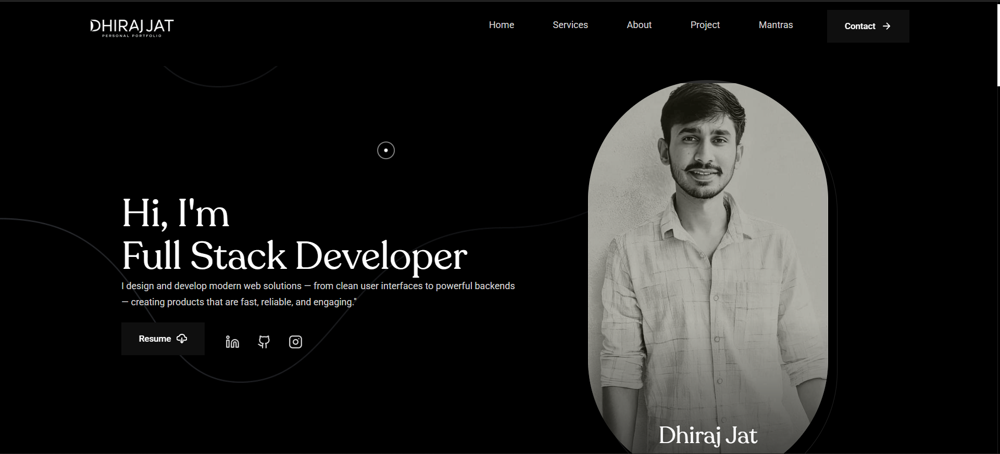

# 🌐 Personal Portfolio - Dhiraj Jat  

This is my **personal portfolio website** built using **HTML, CSS, and JavaScript** with modern 3D effects, smooth scrolling, and stylish typography.  
It showcases my skills, projects, and experience as a **Full Stack Developer**.  

---

## ✨ Features  
- 🎨 Modern and clean UI design  
- ⚡ Smooth scrolling animations  
- 🖼️ 3D & interactive effects  
- 📱 Fully responsive across devices  
- 📝 Resume download option  
- 🔗 Social media links  

---

## 🛠️ Tech Stack  
- **Frontend:** HTML, CSS, JavaScript  
- **Design:** Custom fonts, animations  
- **Effects:** Scrolling effects, 3D elements  
- **Hosting:** (You can add GitHub Pages / Netlify / Vercel if hosted)  

---

## 📸 Preview  

### 🖼️ Home Page  


### 🖼️ Project Section  
  

*(Replace `your-image1.png` and `your-image2.png` with your actual image filenames in the repo.)*  

---

## 🚀 Getting Started  

1. Clone this repository  
   ```bash
   git clone https://github.com/your-username/portfolio.git
